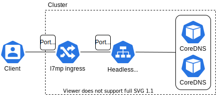

# DNS server with l7mp

A working canary deployment could find here: [canary](dns-l7mp)

In this task you will be able to deploy a CoreDNS DNS server in a Kubernetes cluster and use resilience and request control through l7mp. 

For the sake of simplicity the DNS server provides a simple `A` record, which is looks like this in the config:

```
host.example.com.   IN  A   192.168.1.3
```

## What is a DNS server? 

The Domain Name System ([DNS](https://www.cloudflare.com/learning/dns/what-is-dns/)) is the phonebook of the Internet. When users type domain names such as `google.com` or `nytimes.com` into web browsers, DNS is responsible for finding the correct [IP address](https://www.cloudflare.com/learning/dns/glossary/what-is-my-ip-address/) for those sites. Browsers then use those addresses to communicate with [origin servers](https://www.cloudflare.com/learning/cdn/glossary/origin-server/) or [CDN edge servers](https://www.cloudflare.com/learning/cdn/glossary/edge-server/) to access website information. This all happens thanks to DNS servers: machines dedicated to answering DNS queries.

## Before you begin 

1. You must have a Minikube or some kind of Kubernetes cluster.
2. Basic knowledge about DNS and CoreDNS.

## How to deploy

The architecture what this deployment will produce: 



1. Create the necessary files in Minikube or your environment like that way:

   1. You have to ssh into Minikube `minikube ssh`.

   2. Install a simple text editor: `sudo apt update && sudo apt install nano`.

   3. Then you have to create a folder: `sudo mkdir /mnt/data/config`.

   4. And finally, put these files into the `config` folder:

      1. The `Corefile`: 

         ```
         .:100 {
             forward . 8.8.8.8 9.9.9.9
             log
             errors
         }
         
         example.com:100 {
             file /root/example.db
             log
             errors
         }
         ```

      2. The `example.db`:

         ```
         example.com.        IN  SOA dns.example.com. robbmanes.example.com. 2015082541 7200 3600 1209600 3600
         gateway.example.com.    IN  A   192.168.1.1
         dns.example.com.    IN  A   192.168.1.2
         host.example.com.   IN  A   192.168.1.3
         server.example.com. IN  CNAME   host.example.com
         ```

   5. Exit from Minikube.

2. When the files are existing you, have to create a `persistentVolume` and a `persistentVolumeClaim`: 

   ```yml
   cat <<EOF | kubectl apply -f -
   apiVersion: v1
   kind: PersistentVolume
   metadata:
     name: config-pv
     labels: 
       type: local
   spec:
     storageClassName: manual
     capacity:
       storage: 10Gi
     accessModes:
       - ReadWriteOnce
     hostPath:
       path: "/mnt/data/config"
   ---
   apiVersion: v1
   kind: PersistentVolumeClaim
   metadata:
     name: config-pvc
   spec:
     storageClassName: manual
     accessModes:
       - ReadWriteOnce
     resources:
       requests:
         storage: 2Gi
   EOF
   ```

   This will mount the `/mnt/data/config` folder to the cluster. 

   You should see one after that:

   ```
   $ kubectl get pv 
   NAME        CAPACITY   ACCESS MODES   RECLAIM POLICY   STATUS   CLAIM                STORAGECLASS   REASON   AGE
   config-pv   10Gi       RWO            Retain           Bound    default/config-pvc   manual                  4h55m
   ```

   ```
   $ kubectl get pvc
   NAME         STATUS   VOLUME      CAPACITY   ACCESS MODES   STORAGECLASS   AGE
   config-pvc   Bound    config-pv   10Gi       RWO            manual         4h55m
   ```

   That means the `pv` and the `pvc` is bounded and usable. 

3. Deploy the `Statefulsets` with `headless service`: 

   ```yaml
   cat <<EOF | kubectl apply -f -
   apiVersion: v1
   kind: Service
   metadata:
     name: dns
     labels:
       app: dns
   spec:
     clusterIP: None
     selector:
       app: dns
     ports:
       - protocol: UDP
         port: 100
         targetPort: 100
   ---
   apiVersion: apps/v1
   kind: StatefulSet
   metadata:
     name: dns
     labels:
       app: dns
   spec:
     serviceName: dns
     replicas: 2
     selector:
       matchLabels:
         app: dns
     template:
       metadata:
         labels:
           app: dns
       spec:
         containers:
         - name: dns
           image: coredns/coredns
           args: ["-conf", "/root/Corefile"]
           volumeMounts:
               - name: dns-config
                 mountPath: "/root"
         volumes:
           - name: dns-config
             persistentVolumeClaim:
               claimName: config-pvc
   EOF
   ```

   Because the `headless service` and the `Statefulsets` the pods have static DNS. So the `l7mp` can address them as endpoints. 

4. Deploy the `l7mp`: 

   ```yaml
   cat <<EOF | kubectl apply -f -
   apiVersion: apps/v1
   kind: DaemonSet
   metadata:
     name: l7mp-ingress-gw
     labels:
       app: l7mp-ingress-gw
   spec:
     selector:
       matchLabels:
         app: l7mp-ingress-gw
     template:
       metadata:
         labels:
           app: l7mp-ingress-gw
       spec:
         volumes:
           - name: l7mp-ingress-gw-config
             configMap:
               name: l7mp-ingress-gw
         containers: 
         - name: l7mp
           image: l7mp/l7mp:latest
           imagePullPolicy: IfNotPresent
           command: [ "node" ]
           args: [ "l7mp-proxy.js", "-c", "config/l7mp-ingress-gw.yaml", "-s", "-l", "info"]
           ports:
             - containerPort: 5000
               protocol: UDP
           volumeMounts:
             - name: l7mp-ingress-gw-config
               mountPath: /app/config
         hostNetwork: true
         dnsPolicy: ClusterFirstWithHostNet
   ---
   apiVersion: v1
   kind: ConfigMap
   metadata:
     name: l7mp-ingress-gw
   data:
     l7mp-ingress-gw.yaml: |
       admin:
         log_level: info
         log_file: stdout
         access_log_path: /tmp/admin_access.log
       listeners:
         - name: udp-listener
           spec: {protocol: UDP, port: 5000}
           rules:
             - name: rule-0
               match: {op: starts, path: /IP/src_addr, value: <Docker bridge gateway IP> }
               action:
                 route:
                   destination: coredns
                   retry: 
                     retry_on: always
                     num_retries: 3
                     timeout: 2000
         - name: controller-listener
           spec: { protocol: HTTP, port: 1234 }
           rules:
             - action:
                 route:
                   destination:
                     name: l7mp-controller
                     spec: { protocol: L7mpController }
       clusters:
         - name: coredns
           spec: { protocol: UDP, port: 100 }
           endpoints:
             - name: ep0
               spec: { address: dns-0.dns, port: 100 }
             - name: ep1
               spec: { address: dns-1.dns, port: 100 }
   EOF
   ```

   Whit this configuration you will create a `Pod` per `Node` and define a `listener` whit a `rule` which forward every `UDP` traffic which match with the condition to the `coredns` cluster's endpoints. 

   Be aware about the `<Docker bridge gateway IP>`. This usually `172.17.0.1`, but in some cases this could be different. To see this IP you have to run this command: 

   ```
   docker network inspect bridge
   ```

## Test

First, you have to make sure the service is working, so with the `dig` tool you can receive data about a domain name. 

Try this in your terminal: `dig @$(minikube ip) -p 5000 host.example.com` and the output should look like this: 

```
; <<>> DiG 9.16.1-Ubuntu <<>> @172.17.0.3 -p 5000 host.example.com
; (1 server found)
;; global options: +cmd
;; Got answer:
;; ->>HEADER<<- opcode: QUERY, status: NOERROR, id: 8647
;; flags: qr aa rd; QUERY: 1, ANSWER: 1, AUTHORITY: 0, ADDITIONAL: 1
;; WARNING: recursion requested but not available

;; OPT PSEUDOSECTION:
; EDNS: version: 0, flags:; udp: 4096
; COOKIE: 2902791694e8d9b4 (echoed)
;; QUESTION SECTION:
;host.example.com.		IN	A

;; ANSWER SECTION:
host.example.com.	0	IN	A	192.168.1.3

;; Query time: 36 msec
;; SERVER: 172.17.0.3#5000(172.17.0.3)
;; WHEN: h okt 05 14:59:27 CEST 2020
;; MSG SIZE  rcvd: 89
```

As you can see you got back the `IP` of the requested `Domain name`. 

### Resilience 

The resilience means: the quality of being able to return quickly to a previous good condition after problems. So in that case, what if you are deleting a pod with the following script while an active name resolution? 

Write that script on your local machine and names it something like `pod-del.sh`: 

```bash
#!/bin/bash                                                                                                                               
POD=$1
ENDPOINT=$2
[ -z $POD -o -z $ENDPOINT ] && echo "usage: reset_worker.sh <pod_name> <endpoint_name>" && exit 1
echo Removing pod ${POD}/${ENDPOINT}
# remove pod                                                                                                                              
kubectl delete pod $POD
curl -sX DELETE http://$(minikube ip):1234/api/v1/endpoints/${ENDPOINT}'?recursive=true'
```

Make it runnable if it is not in default: `sudo chmod u+x pod-del.sh`.

So you are able to delete a pod in the cluster and from the l7mp. 

1. In the test case, you have to open a terminal and make continuous name resolution to the DNS server: `watch -n 1 dig @$(minikube ip) -p 5000 host.example.host`.
2. Now use the deletion script: `./pod-del.sh dns-0 ep0`.

As you can see, the name resolution did not stop and works as before the deletion. 

### Request routing 

That means you can restrict the traffic to the DNS server with `l7mp`. 

If you set the `Docker bridge gateway IP` correctly, then you cannot make name resolution from different IPs. So test it out. 

You can specify the source IP for `dig` with the `-b` switch, but you have to give a real IP. For example, your `eth0` interface's IP will be good. 

If you give out that command `dig @$(minikube ip) -p 5000 -b 10.0.2.15 host.example.com` this have to give you an error message. 

```
dig @$(minikube ip) -p 5000 -b 10.0.2.15 host.example.com

; <<>> DiG 9.16.1-Ubuntu <<>> @172.17.0.3 -p 5000 -b 10.0.2.15 host.example.com
; (1 server found)
;; global options: +cmd
;; connection timed out; no servers could be reached
```

## Clean up

```
kubectl delete service dns
kubectl delete statefulset.apps dns
kubectl delete configmap l7mp-ingress-gw
kubectl delete daemonset.apps l7mp-ingress-gw
kubectl delete pv config-pv
kubectl delete pvc config-pvc
```

## Sources

[What is a dns server](https://www.cloudflare.com/learning/dns/what-is-a-dns-server/)

[Running CoreDNS as a DNS server in a container](https://dev.to/robbmanes/running-coredns-as-a-dns-server-in-a-container-1d0)

